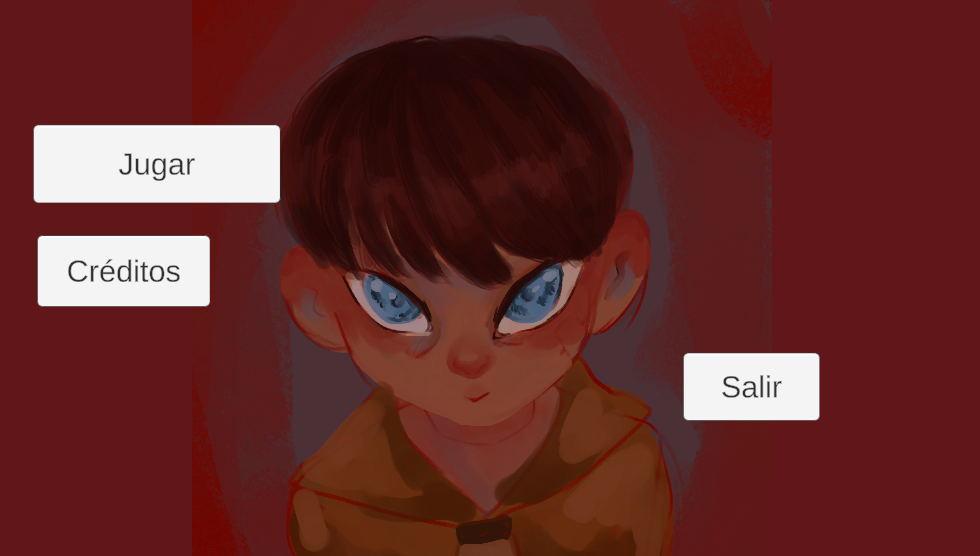
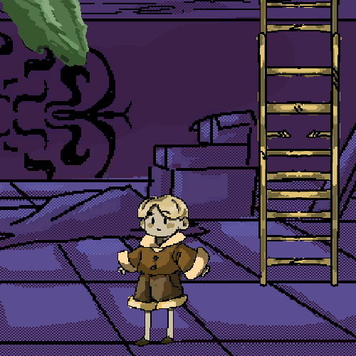
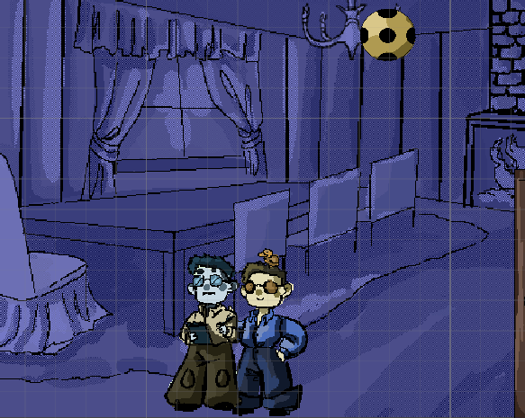
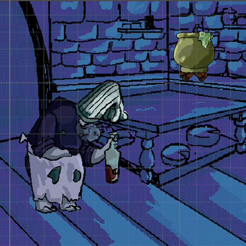
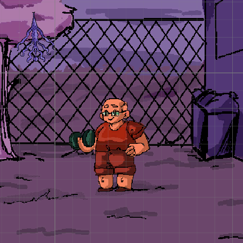

# Don't go up

  

  
  

  
  

## 👥 Integrantes

| Avatar | Miembro | Descripción / Rol |
| :---: | :--- | :--- |
| | **Pablo** | Nuestro niño rubio |
|| **Alejandra** | 
|  | **Alejandro** | 
| | **Hermes** | 
|| **Sara** | 
|  | **Jesus** |

---

## 👁️ Objetivos
**Don't go up** consiste en una aventura narrativa que combina la experiencia de contar una historia con la resolución de puzles y la presencia constante de enemigos. Estos elementos no solo enriquecen la jugabilidad, sino que también añaden tensión y dificultad, obligando al jugador a superar obstáculos mientras avanza en su aventura y descubre los secretos de la trama.

## 👁️ De qué trata nuestro juego
Nuestro juego trata sobre un niño que ha perdido su peluche y está decidido a recuperarlo. Para conseguirlo, deberá subir hasta el **ático del orfanato** donde vive, un lugar estrictamente prohibido por razones que desconoce.

Sin embargo, su motivación no es únicamente encontrar su peluche: el niño también siente una gran curiosidad por descubrir los secretos que oculta el ático. 

## 👁️ A qué se juega
En esencia, el juego se centra en la resolución de puzles y acertijos, así como en esquivar enemigos que dificultarán constantemente el progreso del jugador. A medida que avanza por la aventura, el jugador irá descubriendo fragmentos de información y piezas clave de la historia, que deberá unir poco a poco para comprender por completo el misterio y la trama.

## 👁️ Controles
### Escena de Juego

| Acción | Teclado | Mando (Xbox) |
| :--- | :--- | :--- |
| **Mover a la izquierda** | `A` | Joystick Izquierdo (←) |
| **Mover a la derecha** | `D` | Joystick Izquierdo (→) |
| **Mirar arriba** | `Ctrl` (Izq/Der) | Botón `Y` |
| **Interactuar / Esconderse** | `E` | Botón `A` |
| **Inventario** | `I` | Botón Vista |
| **Pausar el juego** | `Escape` | Botón `≡` (Menú) |

## 👁️ Créditos y Recursos Externos
* "Dentaneosuchus Hunt " Kevin MacLeod (incompetech.com)
Licensed under Creative Commons: By Attribution 4.0 License
http://creativecommons.org/licenses/by/4.0/
* "Anguish" Kevin MacLeod (incompetech.com)
Licensed under Creative Commons: By Attribution 4.0 License
http://creativecommons.org/licenses/by/4.0/
* "Grand Dark Waltz Moderato" Kevin MacLeod (incompetech.com)
Licensed under Creative Commons: By Attribution 4.0 License
http://creativecommons.org/licenses/by/4.0/
*"Magic Escape Room" Kevin MacLeod (incompetech.com)
Licensed under Creative Commons: By Attribution 4.0 License
http://creativecommons.org/licenses/by/4.0/
* "Ossuary 5 - Rest" Kevin MacLeod (incompetech.com)
Licensed under Creative Commons: By Attribution 4.0 License
http://creativecommons.org/licenses/by/4.0/
* "Ossuary 1 - A Beginning" Kevin MacLeod (incompetech.com)
Licensed under Creative Commons: By Attribution 4.0 License
http://creativecommons.org/licenses/by/4.0/

## 👁️ Bug conocidos 
* [Error 1]: No es un error pero puede molestar, si tienes el objeto equipado y das a interactuar con npc que necesita ese objeto, automáticamente te lo quita y sale la escena de dialogos
* [Error 2]: Cuando paras de caminar el idle del niño siempre mira a una dirección concreta, y cuando pasa de andar a quieto a veces resulta raro.
